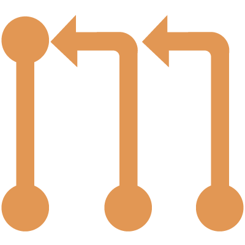

# probot-chain



> a GitHub App built with [probot](https://github.com/probot/probot) that
> makes it easy to manage chained pull requests.

## Usage

Chain helps manage the drudgery of dealing with chained pull requests.
When you open a pull request that is based on another pull request,
simply add `Extend #xx` in the description of the follow-up pull request,
and make sure that the base branch is the head branch of the pull request
that you're wanting to extend.

When the initial pull request is closed or merged,
the follow-up pull request will automatically have it's base
be changed to follow the base of the original pull request,
so that your follow-up pull request is ready to merge.

## Setup

```
# Install dependencies
npm install

# Run the bot
npm start
```

See [docs/deploy.md](docs/deploy.md) if you would like to run your own instance of this app.
